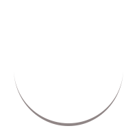

  

    

      
    

  

  <h1 style="margin: 0;">Welcome to my GitHub Profile</h1>

Hey there! I'm Mayar Abuzahra, a passionate computer engineer and coding enthusiast. 

<h3>🛠 Tech Stack</h3>

- 💻 &nbsp; Python | Java | C# | C
- 🌐 &nbsp; HTML5 | CSS3 | JavaScript | Bootstrap | Media Query | React.js | TypeScript | Android 
- 🗃️ &nbsp; MySQL 

## 🌐 Connect with Me

&nbsp;&nbsp;&nbsp;&nbsp;&nbsp;&nbsp;&nbsp;&nbsp;

&nbsp;&nbsp;&nbsp;&nbsp;&nbsp;

## 💬 Contact Me

- Email: mayarabuzahra200030@gmail.com
- Discord: hellomay#8589
  
#### My Stats:
&nbsp;&nbsp;&nbsp;&nbsp;&nbsp;&nbsp;&nbsp;&nbsp;&nbsp;&nbsp;&nbsp;&nbsp;&nbsp;&nbsp;&nbsp;&nbsp;

### My Personal Projects:

See `pinned` below. 

